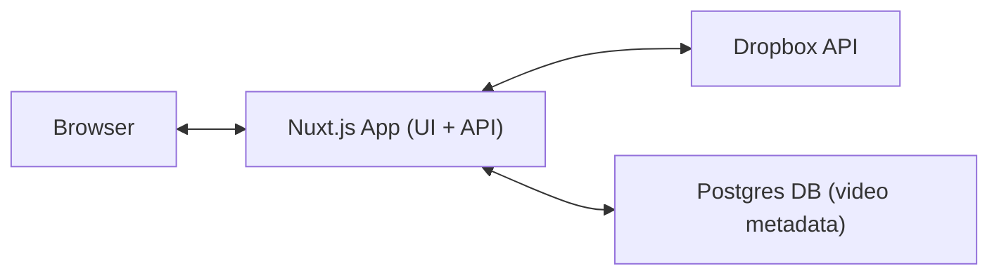
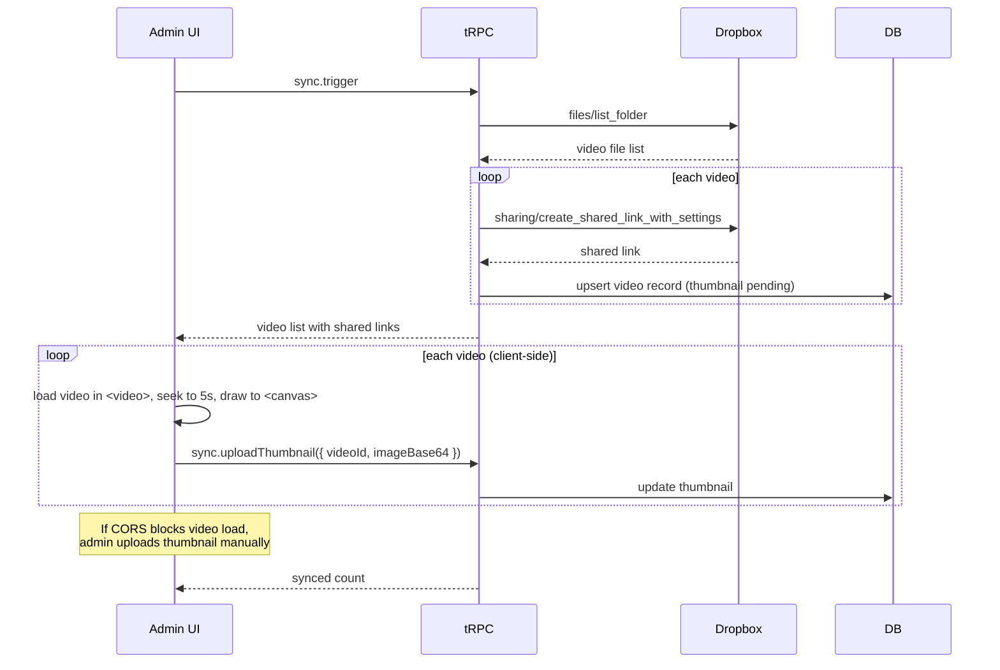
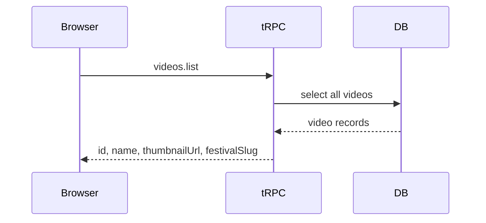
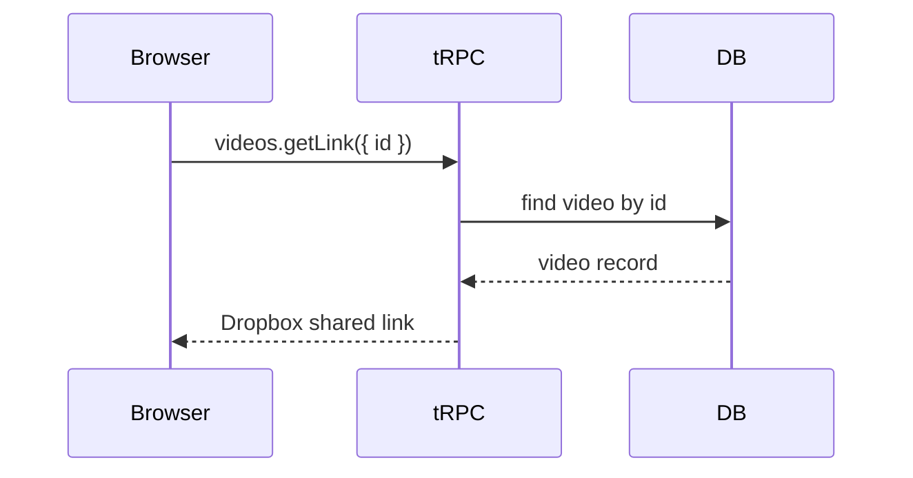

# Claude.ai Project package — sdtv-main-site

## Local source
- Path: C:\Users\ASUS\Projects\sdtv-main-site
- Status: Active — Nuxt code (moved from ~/Orgs/sdtv on 2026-04-24; Nuxt app, brief page, admin, APIs)
- Owner agent (по INDEX): Viktor
- GitHub repo: SocialDanceTV/sdtv (default branch `main`); legacy/studio is its own repo SocialDanceTV/sdtv-studio (`master`, frozen Express+Airtable prototype on Railway)

## Project name (для claude.ai)
SDTV Main Site

## Description (для claude.ai, 1-2 строки)
Nuxt 4 production site для Social Dance TV: видеограф снимает танцевальные фестивали, заливает в Dropbox, посетители покупают доступ к видео; включает admin, capture form и form-flows. Active dev — Alex+Egor пишут код, Viktor курирует.

## Custom Instructions (project system prompt)
Ты технический ассистент по проекту **SDTV Main Site** — Nuxt 4 продакшн-сайт для Social Dance TV. Бизнес: видеограф снимает танцевальные фестивали, заливает футажи в Dropbox, посетители покупают видео или получают доступ через QR. Аудитория сайта: 510K IG / 550K FB / 130K YT — поэтому любой регресс на проде = удар по большой аудитории.

**Стек:** Nuxt 4 + Vue 3.5, tRPC, Prisma + Postgres, Tailwind, shadcn-vue (admin), Bun, Stripe, Resend, Airtable, Dropbox API. Код живёт под `src/`. Dev: `bun run dev` в `src/`.

**Стадия:** Active dev. Прод на socialdancetv.com. Главные потоки: `/capture` (PIN-protected staff form для съёмочной команды), `/form` (client form с оплатами), admin (festival CRUD, Dropbox sync, video management), brief page, public страницы.

**Команда:** Кирилл (founder, владелец, видеограф) + Alex и Egor (нанятые программисты — НЕ co-founders, Кирилл единственный собственник SDTV). Viktor (AI agent) курирует автоматизацию и ревью PR. Не путай с WeDance, где Alex — 50/50 партнёр.

**Constraints:**
- Один change = одна ветка, один PR в `main`. Не мешай несвязанные изменения.
- Не трогай SDTV IG/FB через автоматизацию — только через человека или официальный Meta Business Partner (см. CLAUDE.md hard-ban).
- Безопасность: capture form имеет несколько open issues (Airtable formula injection, hardcoded PIN fallback, no rate limiting) — см. capture-issues.md.
- Never use bg colors на бесед-таблицах админа без обсуждения.

**Что НЕ делай:** не предлагай smen стека (Nuxt стабилен), не пиши длинные option-меню — давай один best next move, не выдумывай Figma node IDs или festival data.

**Tone:** Telegram brief, ru, факт-первым, сразу с кодом или одной командой. Развёрнутая теория — только если Кирилл явно просит.

**Source of truth (источник истины).** Этот проект на claude.ai — snapshot (моментный срез). Полная актуальная информация, история решений и текущий sprint-state живут локально:
- Project path: `C:\Users\ASUS\Projects\sdtv-main-site\` (Windows) / `~/Projects/sdtv-main-site/` (Mac)
- Org hub: `~/Orgs/ikigai/` — agent-memory, OKRs, sprint plans, общая координация

Я работаю со snapshot, не с live state. Если в нашем разговоре принимается решение или появляется важная новая информация — попроси Кирилла зафиксировать через Claude Code (например: "Maya, я в Claude.ai пришёл к решению X по SDTV Main Site — обнови `decisions.md` / `active-deals.md` / `context.md`").

## Knowledge files

### README.md (full paste)
```markdown
# SDTV

A website for a videographer to sell dance festival videos.

## What It Does

The videographer films dance festivals and uploads videos to Dropbox. Visitors browse thumbnails of those videos and purchase the ones they want. After payment, they receive a direct download link.

## User Flow

1. Visitor opens the site and sees a festival's video thumbnails
2. They click a video to get a direct Dropbox link

## Admin Flow

1. Videographer uploads videos to a Dropbox folder (one folder per festival)
2. Admin triggers a sync: the app fetches the video list from Dropbox and generates thumbnails
3. The festival page is live

## Key Features

- **[Dropbox Sync](docs/dropbox.md)**: Reads video list from a Dropbox folder and stores metadata
- **[Thumbnail Generation](docs/thumbnails.md)**: Extracts a frame from each video to use as a preview image
- **Video Access**: Clicking a video serves a direct Dropbox link

## Current Status

- Home page, festivals list, festival detail — implemented, matching Figma
- Admin panel — functional (festival CRUD, Dropbox sync, video management)
- Festival Partners page — implemented
- Backend — tRPC API, Prisma/PostgreSQL, Dropbox integration
- **Pending**: Buy Video flow, Stripe payments, pricing admin, real festival data

## Design

See [docs/design.md](docs/design.md)

## Next Steps

See [docs/next-steps.md](docs/next-steps.md)

Current priority: **Align with Kirill** on festivals, Dropbox structure, and pricing model before building the purchase flow. See [call agenda](docs/call-agenda-2026-03-21.md).

.
```

### CLAUDE.md (if exists, full paste)
— (no top-level CLAUDE.md; project-level rules live in `~/Orgs/ikigai/CLAUDE.md` + `.claude/launch.json`)

### Other key context (max 3)

**Stack note (вместо полного package.json — только meta):**
Stack: Nuxt 4.3, Vue 3.5, tRPC 11, Prisma 7 + Postgres (`@prisma/adapter-pg`, `pg`), Tailwind 4 (beta), shadcn-nuxt + radix-vue + reka-ui, Dropbox 10, Stripe 22, Resend 4, Zod 4, vue3-marquee, lucide-vue-next, @vueuse/core. Dev: Bun. Scripts: `dev`, `build`, `db:seed`, `sync:airtable`. Workspace root is `src/` (project root has its own gitignore + agent metadata).

#### docs/architecture.md (full paste)
```markdown
# Architecture

## Tech Stack

- **Framework**: Nuxt.js v4 (frontend + tRPC server in one app)
- **Package Manager**: Bun
- **API**: tRPC (type-safe API, replaces REST routes)
- **Storage & Delivery**: Dropbox API (video files, shared links)
- **Thumbnail Generation**: Client-side via `<video>` + `<canvas>` (browser extracts frame, uploads to server); manual upload fallback if Dropbox CORS blocks video loading; FFmpeg deferred
- **Database**: Postgres + Prisma (video metadata cache)
- **Styling**: Tailwind CSS
- **UI Components**: shadcn-vue (admin UI only)

**Why client-side thumbnails?** Dropbox `get_thumbnail_v2` only officially supports images ([source](https://www.dropboxforum.com/t5/Dropbox-API-Support-Feedback/Video-thumbnails/td-p/161323)). The browser can extract a frame natively using `<video>` + `<canvas>` — no server dependencies. If Dropbox CORS blocks video loading, the admin uploads a thumbnail image manually. FFmpeg is deferred as a future improvement.

## System Components



## Data Flow

### Admin Sync (`trpc.sync.trigger`)



### Browse (`trpc.videos.list`)



### Access (`trpc.videos.getLink`)



## Configuration

Environment variables:

```
DROPBOX_ACCESS_TOKEN=
DROPBOX_FOLDER_PATH=/DanceFestival2024
DATABASE_URL=
```

## Deferred

- Stripe payments
- Multiple festival navigation
- User accounts
- Webhook-based auto-sync
```

#### docs/next-steps.md (full paste)
```markdown
# Next Steps

## Current: Phase 1 — Vision ✅
README written.

## Phase 2 — Architecture ✅
- [x] Draft `docs/architecture.md` covering system components, Dropbox API flow, thumbnail generation, Stripe checkout, and data storage

## Phase 3 — Data Modeling ✅
- [x] Define `Video`, `Festival`, and `Purchase` types (Prisma schema)

## Phase 4 — UI Implementation ✅
- [x] Home page (matching Figma)
- [x] Festivals list page
- [x] Festival detail page with video grid
- [x] Admin panel (CRUD, Dropbox sync, video management)
- [x] Festival Partners page

## Phase 5 — Align with Kirill (current)
- [ ] Call with Kirill — see [call agenda](call-agenda-2026-03-21.md)
- [x] Add festivals to the system (12 festivals in mock data + seed script):
  - World Stars Salsa Festival 2026
  - Croatian Summer Salsa Festival 2026
  - Miami Salsa Congress 2026
  - Baila NY Fest 2026
  - Riviera Latin Fest 2026
  - Mambo Italiano 2026
  - New York Int Salsa Congress 2026
  - Turkey Summer Dance Festival 2026
  - Legends Old School Congress 2026
  - Salsa Rave 2026
  - Back 2 Mambo 2026
  - Istanbul World Dance Congress 2027
- [ ] Clarify Dropbox folder structure (one per festival vs shared)
- [ ] Confirm pricing model for Stripe integration
- [ ] Decide first festival to launch with

## Phase 6 — Buy Video Flow
- [ ] Implement Buy Video flow from Figma (3-step desktop / 5-step mobile)
- [ ] Connect Stripe for payments
- [ ] Admin panel: pricing configuration

## Phase 7 — Bug Fixes & Polish
- [ ] Fix home page horizontal scroll bug
- [ ] Replace mock data with real festival data
- [ ] Test end-to-end purchase flow

## Phase 8 — Launch
- [ ] Deploy with real data for first festival
- [ ] Verify Stripe payments in production
- [ ] Hand off admin flow to Kirill
```

#### capture-issues.md (full paste)
```markdown
# Capture Form — Issues to Create on GitHub

Live: https://socialdancetv.com/capture
Local: main branch, synced with remote (no differences).
Issues below are bugs/security findings in the current code.

---

## Issue 1: Security — Airtable formula injection in people autocomplete

**Severity: Critical**

`src/server/routes/capture/api/people/autocomplete.get.ts:20` interpolates user input directly into an Airtable formula:

```js
const formula = `OR(FIND("${q}", LOWER({Instagram}))>0, FIND("${q}", LOWER({Name}))>0)`
```

A crafted query like `q="), TRUE())//` could break the formula and return all records from the People table, leaking emails and Instagram handles.

**Fix:** Sanitize `q` — escape double quotes, or whitelist characters (alphanumeric, underscore, dot only).

---

## Issue 2: Security — Hardcoded fallback PIN 'sdtv2026'

**Severity: High**

`src/server/routes/capture/api/verify-pin.post.ts:10`:

```js
const accessPin = (config.captureAccessPin as string) || 'sdtv2026'
```

If `captureAccessPin` env var is not set, anyone who guesses the fallback can access the capture form.

**Fix:** Remove fallback. Return 503 if env var is missing.

---

## Issue 3: Capture — No protection against double-submit

**Severity: High**

QuickEntry and ArtistMode save buttons don't bind `:disabled="isSubmitting"`. On slow connections, users tap multiple times creating duplicate Airtable records (duplicate captures + duplicate clips).

**Fix:**
- Disable button immediately on click
- Show inline spinner
- Server-side: reject duplicate Dance IDs within 5 seconds

**Files:** QuickEntry.vue, ArtistMode.vue, useCaptureState.ts:190

---

## Issue 4: Capture — No rate limiting on capture API endpoints

**Severity: Medium**

All `/capture/api/*` endpoints have no rate limiting:
- `POST /capture/api/captures` — unlimited record creation
- `POST /capture/api/people/upsert` — unlimited people creation
- `GET /capture/api/people/autocomplete` — unlimited lookups (amplifies formula injection)

**Fix:** Add IP-based rate limits. Suggested: 60 req/min on captures, 30 req/min on autocomplete.

---

## Issue 5: Capture — No offline handling or retry logic

**Severity: Medium**

Queue endpoints exist (`queue.get.ts`, `queue.put.ts`) but no client-side offline detection or retry. If network drops during a festival capture, data is lost.

**Fix:**
- Detect `navigator.onLine` state
- Queue captures to localStorage on failure
- Auto-retry when connection restores
- Show offline indicator

---

## Issue 6: Capture — PIN stored in plaintext in localStorage

**Severity: Low** (the PIN is for access control, not a password)

`PinScreen.vue` stores PIN in `localStorage('sdtv_pin')` and auto-verifies on revisit. Any script on the page can read it.

**Fix:** Use a server-issued session token instead, or at minimum use sessionStorage (cleared on tab close).

---

## Previously Created Issues (for /form, not /capture)

- #20 — Multi-clip pricing (Critical)
- #21 — Apple Pay / 3DS handling (Critical)
- #22 — Rate limiting on payment APIs (High)
- #23 — payment-types.ts + assertPayment (High)
- #24 — Promo code state leak (Medium)
- #25 — Preorder secondDance + negative total (Medium)
- #26 — Email notifications (High)
```

## Conversation starters (3-5)
1. Что прямо сейчас критичного в open issues capture form (formula injection, fallback PIN) — какой fix первым делать?
2. Подготовь PR-чеклист для Buy Video Flow Phase 6 (Stripe + pricing admin) — что обязательно затестить перед merge в main.
3. Дай diff для замены `<select>` Day control на toggle row на /capture (см. agent-prompt.md в репо).
4. Объясни client-side thumbnail flow в admin sync и где он может сломаться при Dropbox CORS.
5. Какие festivals из 12 в seed-скрипте можно сразу выкатить как первую launch-цель — что нужно от Кирилла?
